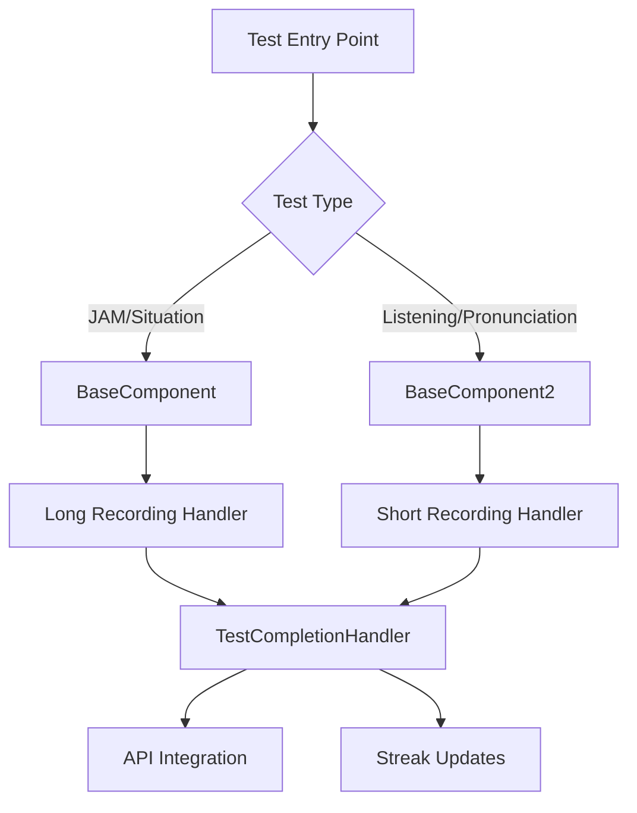

# Design Document

## Overview

The communication test refactor will restructure the existing BaseComponent and BaseComponent2 to follow strict single-responsibility principles. The design separates test execution logic from data processing, creates clear boundaries between different test types, and optimizes performance for each test category.

The refactored system will maintain three core components:
- **BaseComponent**: Handles JAM and Situation tests with long-recording capabilities
- **BaseComponent2**: Handles Listening and Pronunciation tests with short-recording capabilities  
- **TestCompletionHandler**: Processes AI responses and manages API integration

## Architecture

### Component Separation Strategy



### Responsibility Matrix

| Component | JAM Tests | Situation Tests | Listening Tests | Pronunciation Tests | API Integration | UI Rendering |
|-----------|-----------|-----------------|-----------------|-------------------|-----------------|--------------|
| BaseComponent | ✅ | ✅ | ❌ | ❌ | ❌ | ✅ |
| BaseComponent2 | ❌ | ❌ | ✅ | ✅ | ❌ | ✅ |
| TestCompletionHandler | ❌ | ❌ | ❌ | ❌ | ✅ | ❌ |

## Components and Interfaces

### BaseComponent (JAM & Situation Tests)

**Core Responsibilities:**
- Handle JAM and Situation test UI and interactions
- Manage long-duration audio recording (60 seconds)
- Process audio through long-recording API pipeline
- Render test-specific UI elements and chat interface
- Handle single-recording limitation for JAM/Situation tests

**Key Methods:**
```javascript
// Audio processing for long recordings
sendAudioToLongRecordingAPI(audioBlob)
// Test-specific recording duration
getRecordingDuration() // Returns 60 seconds
// Single recording enforcement
startRecording() // Prevents multiple recordings
```

**Removed Responsibilities:**
- Direct API result submission (delegated to TestCompletionHandler)
- Cross-test-type logic
- Unrelated navigation logic

### BaseComponent2 (Listening & Pronunciation Tests)

**Core Responsibilities:**
- Handle Listening and Pronunciation test UI and interactions
- Manage short-duration audio recording (10-15 seconds)
- Process audio through direct API for quick transcription
- Render listening-specific UI elements (audio playback buttons)
- Handle multiple recording sessions per test

**Key Methods:**
```javascript
// Audio processing for short recordings
sendAudioToDirectAPI(audioBlob)
// Test-specific recording duration
getRecordingDuration() // Returns 10-15 seconds based on level
// Audio playback for listening tests
handlePlayAudio(sentence)
```

**Removed Responsibilities:**
- JAM/Situation test logic
- Long-recording API calls
- Unrelated test type handling

### TestCompletionHandler (Data Processing)

**Core Responsibilities:**
- Extract test scores and feedback from AI responses
- Submit test results to appropriate API endpoints
- Update user streaks upon test completion
- Format final reports for different test types
- Handle API errors gracefully

**Key Methods:**
```javascript
// Data extraction from AI responses
extractTestData(response)
// API submission
submitTestResults()
// Report formatting
formatFinalReport(response, reportType)
```

## Data Models

### Test Configuration Interface
```javascript
interface TestConfig {
  testType: 'jam' | 'situation' | 'listening' | 'pronunciation'
  testTitle: string
  testDescription: string
  testLevel: 'basic' | 'intermediate' | 'advanced'
  testDuration: number
  apiEndpoint: string
  recordingMode: 'short' | 'long'
  autoStartMessage: string
}
```

### Audio Processing Pipeline
```javascript
interface AudioProcessingConfig {
  recordingDuration: number
  apiEndpoint: string
  processingMethod: 'direct' | 'long-recording'
  allowMultipleRecordings: boolean
}
```

### Test Result Data
```javascript
interface TestResult {
  sessionId: string
  testType: string
  testLevel: string
  finalScore: number
  feedback: string
  reportType: string
}
```

## Error Handling

### Audio Recording Errors
- Microphone permission failures
- Recording device unavailability
- Audio processing timeouts
- Network connectivity issues during audio upload

### API Integration Errors
- Test result submission failures
- Streak update failures
- Malformed AI response handling
- Rate limiting and retry logic

### User Experience Errors
- Invalid test configurations
- Component mounting/unmounting issues
- State synchronization problems

## Testing Strategy

### Unit Testing Approach
1. **Component Isolation Testing**
   - Test BaseComponent with only JAM/Situation test scenarios
   - Test BaseComponent2 with only Listening/Pronunciation scenarios
   - Test TestCompletionHandler with various AI response formats

2. **Audio Processing Testing**
   - Mock audio recording functionality
   - Test different recording durations
   - Verify correct API endpoint usage

3. **Data Processing Testing**
   - Test score extraction from different report formats
   - Verify API payload construction
   - Test error handling scenarios

### Integration Testing Approach
1. **End-to-End Test Flows**
   - Complete JAM test execution and result submission
   - Complete Listening test with audio playback and recording
   - Test completion handler integration with both component types

2. **API Integration Testing**
   - Test result submission to correct endpoints
   - Streak update verification
   - Error recovery testing

### Performance Testing
1. **Audio Processing Performance**
   - Long-recording API response times
   - Direct API transcription speed
   - Memory usage during recording

2. **Component Rendering Performance**
   - Initial load times for different test types
   - Chat message rendering with formatted content
   - UI responsiveness during audio processing